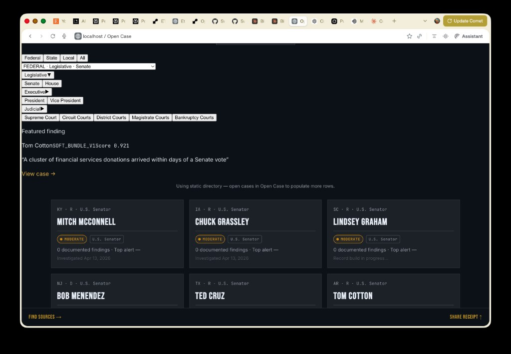

# Open Case

A cryptographically signed government accountability investigation engine.

Open Case cross-references public records — campaign finance, lobbying filings, legislative votes, judicial filings — to surface **proximity and timing patterns** between money and decisions. Findings are epistemically tagged, source-linked, and sealed with Ed25519. The system documents **patterns in public records**; it does **not** assert corruption, guilt, or legal wrongdoing.

**Philosophy:** Receipts, not verdicts. This is a mirror of public records, not a verdict machine.

---

## Verifying this README

Claims below are checked against the repository. If something drifts, use:

| Claim | Where to verify |
|-------|-----------------|
| Automated bundle | `python3 scripts/verify_documentation.py` — pattern rule count (18), client `package.json` scripts, assist router wiring, Debrief structure evidence, pytest collect vs CI floor |
| Claim index (for tools) | `docs/VERIFIABLE_CLAIMS.json` — maps statements to files and the script above |
| Language mix & `client/` + `server/` layout | `docs/DEBRIEF_STRUCTURE_EVIDENCE.json` — SHA-256 of marker files and sorted path lists (regenerate: `python3 scripts/generate_debrief_evidence.py`). Inflated “thousands of Python files” from tools usually counts `venv`/`node_modules`; this file uses explicit exclusions. |
| Pattern rule IDs & engine version | `engines/pattern_engine.py` — `PATTERN_RULE_IDS`, `PATTERN_ENGINE_VERSION` |
| Test count | `PYTHONPATH=. pytest tests/` (full suite). CI enforces a **minimum** passed count via `server/scripts/ci_pytest_floor.py` (see **Tests** below). |
| HTTP API | Run the app and open `GET /openapi.json` |
| Environment | `.env.example` |
| Client scripts | `client/package.json` — `dev`, `build`, `preview` |

---

## Documented exemplar (Tom Cotton / SOFT_BUNDLE)

**Tom Cotton — SOFT_BUNDLE_V1 — score ~0.921** appears in calibration tooling and docs as a **reference exemplar** when FEC + Senate roll-call data align with expectations. **Your deployment does not automatically show this score:** it requires a **case**, **`POST /api/v1/cases/{id}/investigate`** with working keys, and evidence that satisfies the rule. Synthetic tests prove rule behavior; production scores depend on live data.



---

## What it does

1. **Create a case** for a subject (many `subject_type` values exist in `core/subject_taxonomy.py`).
2. **Run investigation** — **`POST /api/v1/cases/{case_id}/investigate`** (Bearer API key). This runs **synchronously** in the HTTP request: ingest adapters → evidence → signals → **pattern engine** → seal. It is **not** continuous real-time surveillance of every official unless **you** schedule or trigger investigations externally.
3. The **pattern engine** scores proximity and structure (**18 rules** in `PATTERN_RULE_IDS` — money/vote timing, fingerprints, sector/geo, procurement loops for local pilot, etc.). Outputs are **alerts and scores**, not legal findings.
4. **Epistemic** classification at ingest (`VERIFIED`, `REPORTED`, etc.).
5. **Cryptographic seal** on the case bundle (`payloads.py` / `signing.py` — JCS-canonical JSON, SHA-256, Ed25519).
6. **Optional:** LLM-assisted story angles (`POST /api/v1/assist/story-angles`) and routed Perplexity/Gemini/Claude for senator dossier enrichment — **core detection does not use LLMs**.

---

## Epistemic levels

Every finding is tagged at ingest. Classification is source-driven, not sentiment-driven.

| Level | Meaning |
|-------|---------|
| `VERIFIED` | Official record — court document, regulatory finding, government disclosure |
| `REPORTED` | Credible named-source journalism or official statement |
| `ALLEGED` | Formal complaint or legal allegation — not yet adjudicated |
| `DISPUTED` | Formal rebuttal or contrary finding on record |
| `CONTEXTUAL` | Unverified public discourse — hidden from public responses by default |

---

## Pattern engine

**Version** `PATTERN_ENGINE_VERSION` in `engines/pattern_engine.py` (e.g. `2.7`). **18 rules** in `PATTERN_RULE_IDS`:

| Rule | Signal |
|------|--------|
| `COMMITTEE_SWEEP_V1` | Donations from industries under direct committee oversight |
| `FINGERPRINT_BLOOM_V1` | Cross-case donor fingerprints |
| `SOFT_BUNDLE_V1` | Donor clustering around legislative events |
| `SOFT_BUNDLE_V2` | Donor clustering (v2 weights: sector, baseline, hearings) |
| `SECTOR_CONVERGENCE_V1` | Sector donation concentration vs committee jurisdiction |
| `GEO_MISMATCH_V1` | Geographic donor anomalies |
| `DISBURSEMENT_LOOP_V1` | PAC disbursement patterns |
| `JOINT_FUNDRAISING_V1` | Joint fundraising committee signals |
| `BASELINE_ANOMALY_V1` | Deviation from historical baseline |
| `ALIGNMENT_ANOMALY_V1` | Vote/donor alignment anomalies |
| `AMENDMENT_TELL_V1` | Amendment timing vs donor activity |
| `HEARING_TESTIMONY_V1` | Testimony/donor overlap (degrades without GovInfo credentials) |
| `REVOLVING_DOOR_V1` | LDA / employment transition overlap with donors |
| `LEGISLATIVE_RELATED_ENTITY_DONOR_V1` | Curated PAC/affiliate vs donor-of-record near roll-call votes |
| `LOCAL_CONTRACTOR_DONOR_LOOP_V1` | Local procurement vendor ↔ donor (direct / curated alias) |
| `LOCAL_CONTRACT_DONATION_TIMING_V1` | Donation timing vs contract award (local, award-only) |
| `LOCAL_VENDOR_CONCENTRATION_V1` | Top vendor vs top donor overlap (local) |
| `LOCAL_RELATED_ENTITY_DONOR_V1` | Curated related-entity donor vs vendor (local) |

Some rules are **conditional** on optional API keys or curated alias data — see `routes/investigate.py` and `docs/internal/PUBLIC_RECORD_STATE.md`.

---

## Subject types vs adapter depth

The **schema** supports many branches and levels (mayor, judge, council, boards, etc.). **Adapter coverage is not uniform:**

- **Federal legislators (FEC + Congress pipeline):** Deepest path — votes, donations, many pattern rules.
- **Federal / Article III judges:** CourtListener + FJC; FEC skipped; pattern alerts often sparse without donation/vote fingerprints.
- **`government_level=local`:** Investigation uses **Indiana IDIS + Indianapolis** procurement and contracts adapters today — **not** a generic US municipal stack. Other local jurisdictions need new adapters.

---

## Data sources

**Implemented in code** (`adapters/`, `routes/investigate.py`):

| Source | What the code does |
|--------|---------------------|
| FEC | Schedule A/B, committees, optional historical/JFC paths — API key optional (`DEMO_KEY` rate-limited). |
| Congress.gov | Votes, amendments — **`CONGRESS_API_KEY` recommended** (degraded behavior if missing). |
| LDA | Lobbying filings — public API without key in typical use. |
| CourtListener | Judicial search — optional `COURTLISTENER_API_KEY`. |
| FJC | Judge bios — HTTP. |
| USASpending | Awards/obligations. |
| GovInfo | Hearings/packages — **requires `GOVINFO_API_KEY`** where used; otherwise skipped or empty. |
| Regulations.gov | **Requires `REGULATIONS_GOV_API_KEY`** when used. |
| Indiana (IDIS bulk) | Indiana disclosure CSVs for local pipeline. |
| Indiana CF portal | **`adapters/indiana_cf.py`** — manual links / gap documented; **not** automated bulk. |
| Indianapolis | Contracts + procurement adapters for **`government_level=local`**. |

**Roadmap / not implemented as first-class adapters:** See `adapters/planned.py` and issues — e.g. PACER, broad local campaign finance beyond pilot scope.

---

## Judicial pilot note

**Indianapolis (S.D. Indiana) + Chicago (N.D. Illinois)** appear in pilot seeding scripts. A **diagnostic narrative** (e.g. Judge Sweeney) reflects **adapter behavior** when CourtListener/FJC return data; **zero pattern alerts** for typical judicial cases without FEC/vote fingerprints is **expected** with current rules.

---

## Static demo directory (not the production database)

The React app lists **reference senators** (e.g. Sullivan, Cotton, Ernst, …) from `client/src/data/officialsDirectory.js` when the API has no cases. That is **UI demo data**, not a guarantee that your database contains completed investigations for each name.

---

## Project structure

```
adapters/       Source integrations (FEC, Congress, CourtListener, FJC, LDA, USASpending, Indianapolis, …)
alembic/        Database migrations (`alembic/versions/` — multiple phase files)
client/         React/Vite — `npm run build` → `client/dist` mounted at `/app`
server/         Python package (`server/services/`, `server/scripts/` — e.g. CI floor, investigate helpers)
core/           Subject taxonomy, credentials, admin gate
data/           Source registry, entity aliases, fixtures
engines/        Pattern engine, signals, entity resolution, temporal proximity
routes/         FastAPI routers (`/cases`, `/api/v1/...`, optional `assist`)
scripts/        CI floor, calibration, pilot seed, diagnostics
services/       Dossier, epistemics, LLM/research routers, gap analysis
tests/          Pytest suite (see **Tests**)
main.py         FastAPI app + static `/app`
models.py       SQLAlchemy models
payloads.py     Sealing / signing payloads
signing.py      Ed25519 helpers
```

**Debrief / DCI:** File-level evidence for language counts and the `client/` + `server/` layout (SHA-256 of marker files and sorted path lists, not statistical inference) is committed in **`docs/DEBRIEF_STRUCTURE_EVIDENCE.json`**. Regenerate after structural changes: `python3 scripts/generate_debrief_evidence.py`.

---

## Tests

```bash
PYTHONPATH=. pytest tests/
```

- **Full suite:** **311** tests collected (run locally to confirm current count).
- **CI:** `.github/workflows/ci.yml` runs `server/scripts/ci_pytest_floor.py`, which requires **≥ 201** passed (regression floor). If the README cites “311,” that is the **current** full run; CI’s floor may lag until updated intentionally.

---

## API (sample)

Case CRUD under **`/cases`**; investigation and JSON reports under **`/api/v1`**.

**OpenAPI:** `GET /openapi.json` — this checkout registered **~47 paths / 48 HTTP operations** (FastAPI route table). Exact counts change with new routes.

| Method | Path | Notes |
|--------|------|--------|
| POST | `/cases` | Create case (Bearer) |
| GET | `/cases/{case_id}` | Case + evidence |
| GET | `/api/v1/cases` | List/filter cases |
| POST | `/api/v1/cases/{case_id}/investigate` | Run pipeline (Bearer) |
| GET | `/api/v1/cases/{case_id}/report` | Signed report JSON |
| GET | `/api/v1/cases/{case_id}/report/view` | HTML report |
| GET | `/api/v1/cases/{case_id}/report/pattern-events` | SSE (pattern refresh) |
| POST | `/api/v1/findings/{finding_id}/dispute` | Dispute (Bearer) |
| POST | `/api/v1/assist/story-angles` | Optional LLM story angles (Bearer + server LLM keys) |
| GET | `/api/v1/subjects/search` | Subject search (`name` query + optional filters) |
| GET | `/api/v1/methodology` | Methodology text |

Admin routes need **`X-Admin-Secret`** / configured **`ADMIN_SECRET`**.

**Routers:** `services/llm_router.py` (story angles), `services/perplexity_router.py` (research enrichment routing).

---

## Setup (development)

### Backend (repo root)

```bash
git clone https://github.com/Swixixle/Open-Case.git
cd Open-Case
python -m venv .venv   # optional
source .venv/bin/activate  # Windows: .venv\Scripts\activate
pip install -r requirements.txt

cp .env.example .env
# DATABASE_URL: defaults to SQLite in .env.example (omit for same)
# FEC_API_KEY: optional; public DEMO_KEY is rate-limited
# CONGRESS_API_KEY: optional; improves member/vote matching
# ADMIN_SECRET: needed for admin-only routes
# Production: set OPEN_CASE_* signing keys explicitly (do not rely on auto-generated keys)

alembic upgrade head
uvicorn main:app --reload --host 127.0.0.1 --port 8000
```

### Frontend (optional — serves `/app` when built)

```bash
cd client
npm ci
npm run build
cd ..
# Restart uvicorn so client/dist is visible
```

**Client `package.json` scripts:** `npm run dev` (Vite dev server), `npm run build` (production bundle), `npm run preview` (preview production build). There is **no** `npm start` — production serves static files via FastAPI or any static host.

**Local API with Vite:** `client/vite.config.js` proxies `/api` to `https://open-case.onrender.com` by default. Point `proxy.target` at `http://127.0.0.1:8000` for a local backend.

### Test

```bash
PYTHONPATH=. pytest tests/
```

---

## Deployment

See **[docs/DEPLOYMENT.md](docs/DEPLOYMENT.md)** — production env vars, Postgres, Render notes, post-deploy checks.

---

## License

See LICENSE. All findings link to primary sources where applicable. This system documents public records and labels them by evidentiary status. No inference of guilt or wrongdoing is made or implied.
