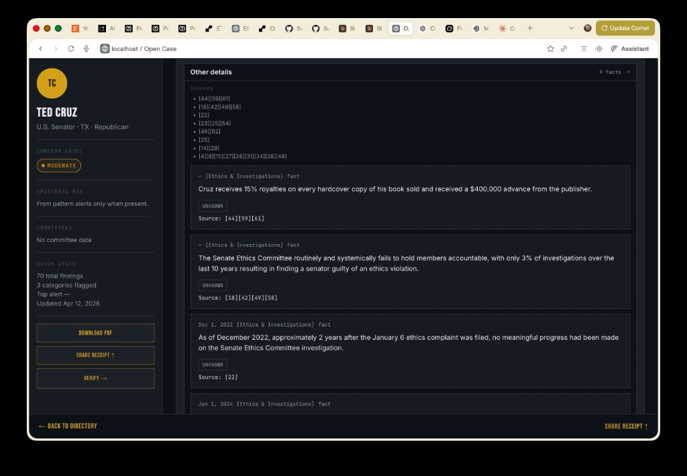

# OPEN CASE — Project state (handoff)

**Live state:** see `AGENTS.md` at the repository root. This file is the archival long-form record and may lag.

**Purpose:** Single document to resume work without prior context.  
**Last regenerated:** 2026-04-09 (from repository inspection; not live production queries unless noted).

**Canonical product docs:** [README.md](../../README.md), [ARCHITECTURE.md](../../ARCHITECTURE.md), [PHILOSOPHY.md](../../PHILOSOPHY.md), [CONSTITUTION.md](../../CONSTITUTION.md).

UI reference screenshots live under [`docs/assets/ui/`](../assets/ui/); this handoff uses one representative ethics / investigations slice:



---

## 1. Repository structure

Annotated tree (source and docs only; excludes `.git`, `.venv`, `__pycache__`, `.pytest_cache`, and local artifacts such as `open_case.db` unless you keep them).

```
.
├── .cursorrules                 # AI/project rules (FastAPI, SQLite, Ed25519; phase constraints)
├── .env.example                 # Template env (copy to `.env`; never commit secrets)
├── alembic.ini                  # Alembic config
├── alembic/
│   ├── env.py                   # Migration runtime (imports models Base)
│   ├── README                   # Alembic notes
│   ├── script.py.mako           # Migration file template
│   └── versions/                # Linear migration chain → see §3
├── auth.py                      # Bearer API key auth; `require_api_key`, `require_matching_handle`
├── core/
│   ├── credentials.py           # CredentialRegistry: env + file-backed adapter keys
│   └── datetime_utils.py        # UTC coercion helpers
├── adapters/
│   ├── __init__.py
│   ├── base.py                  # AdapterResponse / BaseAdapter patterns
│   ├── cache.py                 # SQLite adapter_cache get/store/flush
│   ├── congress_votes.py        # Senate LIS XML roll calls; bioguide↔LIS overrides
│   ├── dedup.py                 # Evidence hash / duplicate detection
│   ├── fec.py                   # OpenFEC Schedule A/B, committee resolution, donor typing
│   ├── govinfo_hearings.py      # GovInfo hearing witness search
│   ├── indiana_cf.py            # Indiana campaign finance API
│   ├── lda.py                   # Senate LDA filings JSON API
│   ├── perplexity_enrichment.py # Perplexity Sonar post-investigate enrichment
│   ├── regulations.py           # Regulations.gov docket comments
│   ├── senate_committees.py     # Senate.gov committee assignments cache
│   └── usa_spending.py          # USASpending awards
├── data/
│   ├── __init__.py
│   ├── entity_aliases.json      # Curated alias table for entity resolution
│   └── industry_jurisdiction_map.py  # Sector ↔ committee/charge code hints (pattern engine)
├── database.py                  # Engine, SessionLocal, init_db (Alembic upgrade + backfills)
├── docs/internal/
│   ├── PROJECT_STATE.md         # This file
│   ├── PHASE11_VISION.md        # Planned identity / receipt evolution (not all implemented)
│   └── cursor_new_case_types.md  # Scaffold notes for future case types
├── engines/
│   ├── contract_anomaly.py      # Contract-adjacent anomaly signals
│   ├── contract_proximity.py    # Contract proximity pairing for signals
│   ├── entity_resolution.py     # Donor canonicalization + alias resolution (see §7)
│   ├── pattern_engine.py        # Cross-case pattern rules + PatternAlert generation (see §6)
│   ├── political_calendar.py    # FEC/election calendar discounting for temporal scoring
│   ├── relevance.py             # Signal relevance helpers
│   ├── signal_receipt_backfill.py
│   ├── signal_scorer.py         # Builds signals from proximity / contract / anomalies
│   └── temporal_proximity.py   # Donation ↔ vote clustering (“temporal proximity”)
├── jobs.py                      # Placeholder for future queue workers
├── main.py                      # FastAPI app, lifespan (DB init, APScheduler enrichment tick)
├── models.py                    # SQLAlchemy ORM — full schema in §3
├── payloads.py                  # Case/evidence sealing, signed_hash packing
├── routes/
│   ├── __init__.py
│   ├── admin.py                 # /api/v1/admin — cache clear (unauthenticated; dev/ops)
│   ├── auth.py                  # POST /api/v1/auth/keys — issue investigator API key
│   ├── cases.py                 # /cases — CRUD-ish case routes (mounted at root; see §4)
│   ├── entity_resolution.py     # /api/v1/entity-resolution — suggest + admin alias append
│   ├── evidence.py              # Attached under cases router — manual evidence POST
│   ├── evidence_disambig.py     # PATCH evidence disambiguation
│   ├── investigate.py           # /api/v1 — investigate, enrichment, batch-open, signals
│   ├── patterns.py              # /api/v1/patterns — pattern engine read API
│   ├── proportionality_view.py  # EthicalAlt proportionality proxy for report UI
│   ├── reporting.py             # HTML/JSON reports, signal expose, investigator score
│   ├── snapshots.py             # Attached — case snapshot POST (sealed bundle)
│   ├── subjects.py              # Static subject search + bioguide helper
│   └── system.py                # /api/v1/system/credentials — list/register credentials
├── scoring.py                   # Investigator credibility bumps
├── scripts/
│   ├── backfill_donor_types.py
│   ├── backfill_signal_receipt_dates.py
│   └── seed_political_calendar.py
├── services/
│   ├── enrichment_service.py    # Background Perplexity run + DB receipt
│   ├── enrichment_signing.py    # JCS + Ed25519 pack for enrichment receipts
│   ├── proportionality.py       # EthicalAlt packets for signals (sync/async)
│   └── proportionality_client.py
├── signals/
│   └── dedup.py                 # Signal upsert, identity hash, merge logic
├── signing.py                   # Ed25519 JCS signing (platform keys); verify helpers
├── scoring.py
├── templates/
│   ├── report.html              # Journalist-facing HTML report
│   └── proportionality_macros.html
├── tests/                       # pytest suite — see §14
│   ├── conftest.py              # In-memory SQLite, TestClient, patches `init_db`
│   └── …                        # One file per major subsystem
├── CONTRIBUTING.md
├── ARCHITECTURE.md
├── CONSTITUTION.md
├── PHILOSOPHY.md
├── README.md
├── SECURITY.md
├── LICENSE
├── requirements.txt
└── .github/
    ├── workflows/ci.yml         # pip install + compileall (does not run pytest)
    └── …                        # Issue/PR templates, copilot instructions
```

---

## 2. Stack

Pinned in [requirements.txt](../../requirements.txt) as minimum versions (`>=`).

| Dependency | Version | Purpose | If missing / broken |
|------------|---------|---------|---------------------|
| **fastapi** | ≥0.115 | HTTP API, routing, dependencies, OpenAPI | App does not start |
| **uvicorn[standard]** | ≥0.32 | ASGI server | Cannot serve HTTP |
| **sqlalchemy** | ≥2.0 | ORM, queries, migrations metadata | No persistence layer |
| **python-dotenv** | ≥1.0 | Load `.env` | Defaults only; prod may misconfigure |
| **cryptography** | ≥43 | Ed25519 signing / verification | Seals and verification fail |
| **jcs** | ≥0.2 | JSON canonicalization for hashes | Signing digest mismatch |
| **pydantic** | ≥2.9 | Request/response models | Route validation breaks |
| **httpx** | ≥0.27 | Async HTTP for adapters | External data adapters fail |
| **alembic** | ≥1.14 | Schema migrations | `init_db` cannot upgrade schema |
| **jinja2** | ≥3.1 | HTML report templates | Report views break |
| **pytest** | ≥8.0 | Tests | CI/local test runs unavailable |
| **apscheduler** | ≥3.10 | 24h enrichment refresh job | Scheduler missing; interval job not run |

**Runtime:** Python 3.12+ typical (CI uses 3.12). SQLite default; Postgres supported via `DATABASE_URL`.

---

## 3. Data layer

### 3.1 Schema (all tables)

Source of truth: [models.py](../../models.py) + Alembic. Below mirrors ORM.

**case_files** — Investigation case (“case file”).  
- `id` UUID PK  
- `slug` unique indexed  
- `title`, `subject_name`, `subject_type`, `jurisdiction`, `status`  
- `created_at`, `created_by`, `summary`, `pickup_note`  
- `signed_hash`, `last_signed_at` — case-level seal  
- `view_count`, `is_public`  
- `last_source_statuses` — JSON text of last adapter status list from investigate  
- `last_enriched_at` — last Perplexity enrichment run (nullable)  
- Relationships: `evidence_entries`, `case_snapshots`  

**evidence_entries** — Evidence rows (adapters + manual).  
- `id` UUID PK, `case_file_id` FK → `case_files.id` CASCADE  
- `entry_type`, `title`, `body`, `source_url`, `source_name`, `date_of_event`  
- `entered_at`, `entered_by`, `signed_hash`, `confidence`  
- `is_absence`, `flagged_for_review`, `amount`, `matched_name`  
- `raw_data_json`, `evidence_hash` indexed, disambiguation fields  
- `adapter_name`, `jurisdictional_match`, `matched_committees` (JSON text), `donor_type`  

**investigators** — Investigator profile + **hashed** API key.  
- `id` UUID PK, `handle` unique  
- `public_key`, `credibility_score`, `cases_opened`, `entries_contributed`, `joined_at`, `is_anchor`  
- `hashed_api_key`, `api_key_created_at`  

**case_contributors** — Case ↔ investigator roles.  
- Unique (`case_file_id`, `investigator_handle`)  

**source_check_logs** — Source check audit rows per case.  

**case_snapshots** — Sealed snapshots (numbered).  
- `signed_hash`, `share_url`, `label`  

**signals** — Proximity / contract / anomaly signals.  
- Unique (`case_file_id`, `signal_identity_hash`)  
- `signal_type`, `weight`, `description`, `evidence_ids` (JSON text)  
- Actors, dates, `days_between`, `amount`  
- `exposure_state` (e.g. internal / unresolved), routing, repeat_count, confirmation fields  
- Temporal / relevance / cross-case columns — see model for full list  

**signal_audit_log** — Confirm/dismiss/weight audit.  

**adapter_cache** — Cached adapter HTTP responses (`adapter_name`, `query_hash`, TTL).  

**subject_profiles** — Per-case subject metadata (e.g. `bioguide_id`).  

**political_events** — Calendar table (FEC/elections); integer PK.  

**senator_committees** — Cached Senate.gov committees per `bioguide_id`.  

**donor_fingerprints** — Cross-case donor fingerprint rows tied to signals.  

**investigation_runs** — Per-investigate run summary (`top_donors` JSON text).  

**enrichment_receipts** — Signed Perplexity enrichment receipts.  
- `id` UUID PK, `case_file_id` FK CASCADE, `subject_name`, `bioguide_id`  
- `queried_at`, `findings` JSON array, `new_findings_count`, `is_delta`  
- `signed_receipt` text (packed JSON with hash + signature + payload)  
- `version`  

**pattern_alert_records** — Persisted pattern engine snapshots (global refresh on seal path).  
- `rule_id`, `pattern_version`, `donor_entity`, `matched_officials`, `matched_case_ids` (text JSON)  
- `committee`, `window_days`, `evidence_refs`, `disclaimer`, `fired_at`, `diagnostics_json`  

### 3.2 Current database contents

**Not stored in git.** Counts depend on which `DATABASE_URL` you use.

Example **local** workspace file `open_case.db` (snapshot at handoff generation):  
- `case_files`: 2  
- `signals`: 0  
- `pattern_alert_records`: 0  
- `subject_profiles` (public_official): 1  

**Production (Render):** Query live DB or use admin SQL. Illustrative SQL:

```sql
SELECT COUNT(*) FROM case_files;
SELECT COUNT(*) FROM signals;
SELECT COUNT(*) FROM pattern_alert_records;
SELECT COUNT(*) FROM subject_profiles WHERE subject_type = 'public_official';
```

There is **no** dedicated “senators” table — senators appear as `subject_profiles.bioguide_id` on cases and in adapter mapping dictionaries.

### 3.3 Alembic

- **Current head:** `f2e3d4c5b6a7` — Phase 11 enrichment receipts + `case_files.last_enriched_at`.  
- Run: `alembic upgrade head` (or `database.init_db()` on app startup).

---

## 4. API endpoints

**Global:** FastAPI auto-docs at `/docs` and `/redoc` when the app runs.  
**Auth:** Investigator routes expect `Authorization: Bearer open_case_<64 hex>` unless noted.

Router mount summary (from [main.py](../../main.py)):

| Prefix | Module | Notes |
|--------|--------|--------|
| `/api/v1/admin` | `routes/admin.py` | |
| `/api/v1` | `routes/auth.py` | Only `auth` routes below |
| `/cases` | `routes/cases.py` | **No** `/api/v1` prefix |
| `/api/v1/entity-resolution` | `routes/entity_resolution.py` | |
| `/api/v1` | `routes/investigate.py` | Large surface |
| `/api/v1` | `routes/patterns.py` | |
| `/api/v1` | `routes/proportionality_view.py` | |
| `/api/v1/evidence` | `routes/evidence_disambig.py` | |
| `/api/v1` | `routes/reporting.py` | |
| `/api/v1/subjects` | `routes/subjects.py` | |
| `/api/v1/system` | `routes/system.py` | |

`routes/evidence.py` and `routes/snapshots.py` attach nested routes onto the **cases** router (`/cases/...`).

### 4.1 `routes/cases.py` — prefix `/cases`

| Method | Path | Auth | Behavior |
|--------|------|------|----------|
| POST | `/cases` | API key | Create case; seal empty case |
| GET | `/cases/browse/available` | None | List cases by status (default `needs_pickup`) |
| PATCH | `/cases/{case_id}/status` | API key | Status / pickup note |
| POST | `/cases/{case_id}/pickup` | API key | Claim case |
| GET | `/cases/{case_id}` | None | Case detail + evidence + signature check |
| POST | `/cases/{case_id}/evidence` | API key | Manual evidence (see `ENTRY_TYPES` in evidence.py) |
| POST | `/cases/{case_id}/snapshot` | API key | Sealed snapshot |

### 4.2 `routes/auth.py` — prefix `/api/v1`

| Method | Path | Auth | Behavior |
|--------|------|------|----------|
| POST | `/api/v1/auth/keys` | None (bootstrap) | Create investigator + return one-time API key |

### 4.3 `routes/investigate.py` — prefix `/api/v1`

| Method | Path | Auth | Behavior |
|--------|------|------|----------|
| POST | `/api/v1/cases/batch-open` | API key | Open multiple cases from subject list |
| POST | `/api/v1/cases/{case_id}/investigate` | API key | Full investigation pipeline; **background** `run_enrichment` after successful commit |
| GET | `/api/v1/cases/{case_id}/enrichment` | API key | List `EnrichmentReceipt` rows (newest first), includes `signed_receipt` |
| GET | `/api/v1/cases/{case_id}/signals` | None | List signals for case (weights desc); optional hide unresolved |
| PATCH | `/api/v1/signals/{signal_id}/confirm` | API key | Confirm signal |
| PATCH | `/api/v1/signals/{signal_id}/dismiss` | API key | Dismiss with reason |

### 4.4 `routes/patterns.py` — `/api/v1`

| Method | Path | Auth | Behavior |
|--------|------|------|----------|
| GET | `/api/v1/patterns/diagnostics?case_id=` | None | SOFT_BUNDLE_V2 diagnostics for one case |
| GET | `/api/v1/patterns` | None | Run pattern engine; optional `donor`, `rule`, `case_id` filters |

### 4.5 `routes/reporting.py` — `/api/v1`

| Method | Path | Auth | Behavior |
|--------|------|------|----------|
| GET | `/api/v1/cases/{case_id}/report` | Mixed — see code | JSON report payload |
| GET | `/api/v1/cases/{case_id}/report/view` | Mixed | HTML report |
| GET | `/api/v1/cases/{case_id}/report/card` | Mixed | Receipt card HTML |
| PATCH | `/api/v1/signals/{signal_id}/expose` | API key | Exposure / routing |
| GET | `/api/v1/signals/{signal_id}/history` | API key | Audit log |
| GET | `/api/v1/investigators/{handle}/score` | None | Credibility score |

### 4.6 Other routers

| Module | Notable routes | Auth |
|--------|----------------|------|
| `admin.py` | POST `/api/v1/admin/clear-cache` | **None** (documented as dev/ops — lock down in prod if needed) |
| `subjects.py` | GET `/api/v1/subjects/search`, GET `/api/v1/subjects/bioguide/{id}` | None |
| `entity_resolution.py` | GET `/api/v1/entity-resolution/suggest`; POST `.../aliases` | Suggest none; aliases need `X-Admin-Secret` |
| `evidence_disambig.py` | PATCH `/api/v1/evidence/{id}/disambiguate` | API key |
| `proportionality_view.py` | GET `/api/v1/proportionality/facility-preview` | None |
| `system.py` | GET/POST `/api/v1/system/credentials` | Register needs `X-Admin-Secret` |

---

## 5. Adapters

### 5.1 FEC (`adapters/fec.py`)

- **OpenFEC API** via httpx; credential from `FEC_API_KEY`, CredentialRegistry `fec`, or demo key behavior as implemented.
- **Endpoints / usage:**  
  - Candidate/committee search (`/candidates/search/` etc.) for resolving principal committee.  
  - **Schedule A** — contributions to committee or by contributor (see `search()` paths in module).  
  - **Schedule B** — disbursements (optional; soft-empty on some HTTP errors — see tests).  
- **Outputs:** `AdapterResponse` with normalized `AdapterResult` rows, hashes, donor classification (`classify_donor_type`).

### 5.2 Congress votes (`adapters/congress_votes.py`)

- **Senate LIS XML:** `https://www.senate.gov/legislative/LIS/roll_call_votes/...` — parses roll call XML for member votes.  
- **Bioguide → LIS member id:** `LIS_MEMBER_ID_BY_BIOGUIDE` for a **small** set of senators where Congress.gov match is insufficient; includes explicit comment: **S001198 (Dan Sullivan) must not use S000033 (Bernie Sanders)**.  
- Caps: `MAX_VOTE_RESULTS`, `MAX_ROLLS_SCAN`, `MAX_ROLL_CAP` to bound crawl.  
- Congress.gov API may be used for member metadata when key present (`CredentialRegistry` / env).

### 5.3 LDA (`adapters/lda.py`)

- **URL:** `https://lda.senate.gov/api/v1/filings/`  
- **Query params:** `registrant_name`, `client_name` pagination; last two calendar years.  
- Returns normalized filing dicts for revolving-door / enrichment paths in investigate.

### 5.4 Perplexity enrichment (`adapters/perplexity_enrichment.py`)

- **API:** `https://api.perplexity.ai/chat/completions`, model `sonar`, `search_recency_filter: "month"`.  
- **Env:** `PERPLEXITY_API_KEY` — if missing, logs warning and returns `[]` (non-fatal).  
- **Queries:** four fixed templates (financial disclosure, ethics/legal, board/family, major news sites).  
- **Output:** list of findings `{source_url, citation, summary, retrieved_at, query}`; dedupe by URL; absence rows when no citations.

### 5.5 Other adapters

| Module | Source | Role |
|--------|--------|------|
| `regulations.py` | Regulations.gov | Docket comments for donor entities |
| `govinfo_hearings.py` | GovInfo | Congressional hearing witnesses |
| `usa_spending.py` | USASpending | Federal awards |
| `indiana_cf.py` | Indiana API | State-level finance for IN subjects |
| `senate_committees.py` | Senate.gov | Committee assignments → DB cache |
| `cache.py` | SQLite | Response caching / bust |
| `dedup.py` | — | Evidence hashing / duplicate detection |

---

## 6. Pattern engine

**Engine version constant:** `PATTERN_ENGINE_VERSION = "2.2"` in [engines/pattern_engine.py](../../engines/pattern_engine.py).

### 6.1 Rules implemented (rule IDs)

| Rule ID | What it detects (summary) | Scoring / notes |
|---------|----------------------------|-----------------|
| `COMMITTEE_SWEEP_V1` | Same donor spread across ≥`COMMITTEE_SWEEP_MIN_OFFICIALS` (3) officials in short window | suspicion combines concentration × profile × deadline discount |
| `FINGERPRINT_BLOOM_V1` | Donor fingerprint appears across ≥`FINGERPRINT_BLOOM_MIN_CASES` (4) cases with relevance floor | Uses relevance and cross-case data |
| `SOFT_BUNDLE_V1` | ≥3 unique donors to same committee within `SOFT_BUNDLE_MAX_SPAN_DAYS` (7), min aggregate $1000 | Classic soft bundle |
| `SOFT_BUNDLE_V2` | Same windowing as V1 with **suspicion_score** from donor mix, sector similarity, baseline spike, hearing proximity | `diagnostics_json` on alerts; `/patterns/diagnostics` |
| `SECTOR_CONVERGENCE_V1` | Same sector donors cluster in time (≥3 donors, 14d window, $5k aggregate) | `sector_concentration` × profile × discounts × vote text match multiplier |
| `GEO_MISMATCH_V1` | High share of **individual** out-of-state donors vs home state | Ratio thresholds; org names excluded from “individual” geo |
| `DISBURSEMENT_LOOP_V1` | Committee disbursement loop patterns | suspicion 1.0 or 0.5 based on loop confirmation |
| `JOINT_FUNDRAISING_V1` | JFC / joint fundraising structure signals | Uses upstream counts |
| `BASELINE_ANOMALY_V1` | Spike vs historical baseline for donor | Skipped in tests for “ghost” cases without vote context (see tests) |
| `ALIGNMENT_ANOMALY_V1` | Alignment of donation timing vs baseline | z-score style component |
| `AMENDMENT_TELL_V1` | Amendment vote proximity / tells | |
| `HEARING_TESTIMONY_V1` | Hearing witness overlap with donor context | |
| `REVOLVING_DOOR_V1` | LDA registrant overlap near relevant votes | Blocklist for generic donors |

Exact formulas and thresholds live in `pattern_engine.py` and [ARCHITECTURE.md](../../ARCHITECTURE.md) (pattern section).

### 6.2 Alert counts in production

**Not available in the repository.** Query `pattern_alert_records` or call `GET /api/v1/patterns` against production with an API key.

### 6.3 Known issues / false positives

- **Sector / name classification:** Employer and occupation strings are noisy; sector tags can misclassify.  
- **GEO_MISMATCH:** Individual vs org classification uses name markers; edge cases for ambiguous names.  
- **Baseline / calendar:** `political_calendar` and “ghost” vote context tests document cases where baseline anomaly is skipped (`test_political_calendar.py`).  
- **Cross-case rules:** Depend on donor fingerprint quality; unresolved entity resolution inflates fragmentation.

### 6.4 Planned / not built

- **DONOR_CONVERGENCE_V1:** **Not present** in the codebase under that ID. Closest existing rule family: **`SECTOR_CONVERGENCE_V1`** (sector-based convergence). Any separate “donor convergence” product spec would be external or not yet implemented.  
- Broader roadmap: [docs/internal/PHASE11_VISION.md](PHASE11_VISION.md) (identity, dual-signature receipts — mostly planned).

---

## 7. Entity resolution

**Module:** [engines/entity_resolution.py](../../engines/entity_resolution.py).

**Behavior:**

1. **canonicalize** — Uppercase, strip noise tokens (PAC, LLC, …), normalize punctuation.  
2. **Alias table** — [data/entity_aliases.json](../../data/entity_aliases.json): canonical_id, canonical_name, alias list. Match exact canonical or alias.  
3. **Unresolved** — `canonical_id` = slug of normalized text; `resolution_method` = `unresolved`.

**API:**

- `resolve(name)` → `ResolvedEntity` with `canonical_id`, `canonical_name`, `resolution_method`, `normalized_name`.  
- `suggest_aliases` / `suggest_aliases_detail` — Jaccard-style token overlap for **human review only** (never auto-merge).

**`legal_entity_id` / `family_entity_id`:** **Not used** in this repository. There is no split between legal vs family entity IDs in code; identity is `canonical_id` + resolution method only.

**Gaps:** Fuzzy merge is suggest-only; typos across filings remain separate unless aliased manually. No automated graph of corporate families beyond heuristics in pattern engine.

---

## 8. Senators in dataset

**There is no exported master list** of all US senators in-repo.

**Code-defined mappings:**

1. **`LIS_MEMBER_ID_BY_BIOGUIDE`** in `congress_votes.py` — bioguide → LIS id for: B001306, C000127, C000880, C001095, E000295, G000386, S001198, S001181, W000779, Y000064.  
2. **`SENATOR_HOME_STATE`** in `pattern_engine.py` — subset for geo / context (includes B001236, etc.).  
3. **`routes/subjects.py` — `INDIANA_OFFICIALS`:** Todd Young (Y000064, fec `C00459255`), Victoria Spartz, André Carson, … (House members included — not senators only).

**Per-deployment data:** For each case, join `case_files` + `subject_profiles` where `subject_type = public_official` and `bioguide_id` is set; count signals with `signals.case_file_id`. **Production:** run SQL or export from admin tooling.

---

## 9. Known bugs and open issues

| Topic | Description |
|-------|-------------|
| **Investigate HTTP 422** | Returned when **required core adapters** fail (FEC/Congress as configured) — transaction rolled back; see `routes/investigate.py` JSON error body with `source_statuses`. |
| **Zero signals guardrail** | Successful run that yields **zero** signals when prior run had signals → **422** (protects accidental wipe). |
| **Bernie Sanders vs Dan Sullivan** | `LIS_MEMBER_ID_BY_BIOGUIDE` documents **S001198** maps to Sullivan’s LIS id **S383**, not Bernie’s bioguide **S000033** — wrong mapping would attribute votes incorrectly. |
| **FEC Schedule B 422** | Adapter may treat some 422 responses as soft-empty Schedule B (see `test_fec_schedule_b.py`). |
| **Shaheen** | Listed in LIS map as **S001181 → S324**; any “ghost alert” issues would be operational/data — track in issues with reproduction; tests use synthetic “ghost” cases for baseline skipping. |
| **Admin `/clear-cache`** | Unauthenticated — acceptable only in controlled dev; secure or remove in untrusted environments. |

Search the issue tracker and `tests/` for regressions not listed here.

---

## 10. Pattern alerts — production state

**Repository cannot know live alert counts or top-N scores.**

**To obtain:**

1. `GET https://open-case.onrender.com/api/v1/patterns` with Bearer key — returns alerts with `suspicion_score` where applicable.  
2. SQL: `SELECT rule_id, COUNT(*) FROM pattern_alert_records GROUP BY rule_id;`  
3. Sort client-side by `suspicion_score` for top 5.

---

## 11. DONOR_CONVERGENCE_V1

- **Status:** **Not implemented** as a named rule in [engines/pattern_engine.py](../../engines/pattern_engine.py).  
- **Closest existing:** `SECTOR_CONVERGENCE_V1` (sector-tagged donors, time window, aggregate threshold).  
- **If building a new rule:** Add a new `RULE_*` constant, bump or extend `PATTERN_ENGINE_VERSION`, implement `_detect_*`, extend `run_pattern_engine`, add tests in `tests/test_pattern_engine.py`.

---

## 12. Philosophy

**Receipts, not verdicts** (see [PHILOSOPHY.md](../../PHILOSOPHY.md), [CONSTITUTION.md](../../CONSTITUTION.md)):

- Outputs document **what public records showed** at a point in time, with **sources**, **absence** where relevant, and **cryptographic seals** where implemented.  
- **Scores and pattern alerts** are **signals**, not accusations of illegality or intent. Disclaimers are embedded in pattern text (`PATTERN_ALERT_DISCLAIMER`).  
- **Enrichment** (Perplexity) adds **sourced summaries**; signed `EnrichmentReceipt` rows are **not** factual findings of wrongdoing.  
- **Design consequence:** Adapter failures surface as status + absences; investigate may refuse to commit (422) when core evidence fails — preserving integrity over empty success.

---

## 13. Deployment

**Documented live URL:** https://open-case.onrender.com (see README).

**Typical stack:** Render web service, `DATABASE_URL` pointing to Postgres, env vars from `.env.example` + secrets.

**Required / important env vars** (non-exhaustive — see [README.md](../../README.md) and [.env.example](../../.env.example)):

- `DATABASE_URL` — production Postgres recommended.  
- `BASE_URL` — public origin; **required** when `ENV=production` (localhost forbidden).  
- `ENV` — `development` vs `production`.  
- `OPEN_CASE_PRIVATE_KEY` / `OPEN_CASE_PUBLIC_KEY` — signing (auto-bootstrap in dev if missing).  
- `ADMIN_SECRET` — admin routes (`X-Admin-Secret`).  
- `CREDENTIAL_DATA_DIR` — optional file-backed credentials.  
- Adapter keys: `FEC_API_KEY`, `CONGRESS_API_KEY`, `REGULATIONS_GOV_API_KEY`, `GOVINFO_API_KEY`, `PERPLEXITY_API_KEY`, etc.  
- `SKIP_EXTERNAL_PROPORTIONALITY` — tests / CI.  

**Health check:** No dedicated `/health` route in codebase; use `/docs` or a lightweight GET that exists publicly (e.g. `/api/v1/patterns` returns computed data — prefer adding a dedicated health route in ops if load balancer requires it).

---

## 14. Tests

- **Count:** **158** tests collected (`pytest --collect-only` with `PYTHONPATH=.`).  
- **Coverage (high level):** Pattern engine, investigate pipeline (mocked adapters), FEC/congress honesty, temporal/contract signals, entity resolution, credentials, proportionality stubs, reporting views, guardrails (422 paths), signal dedup/confirmation.  
- **How to run:**

```bash
cd Open-Case
python -m venv .venv && source .venv/bin/activate
pip install -r requirements.txt
PYTHONPATH=. pytest tests/
```

- **CI (.github/workflows/ci.yml):** Installs dependencies and runs `python -m compileall` only — **does not run pytest**. Consider adding `PYTHONPATH=. pytest` to CI for regression safety.

---

## Appendix: Quick reference URLs (production)

| Resource | URL |
|----------|-----|
| App | https://open-case.onrender.com |
| OpenAPI | https://open-case.onrender.com/docs |

---

*This file is maintained for engineer handoff; update Alembic head, test count, and production metrics when they change.*
