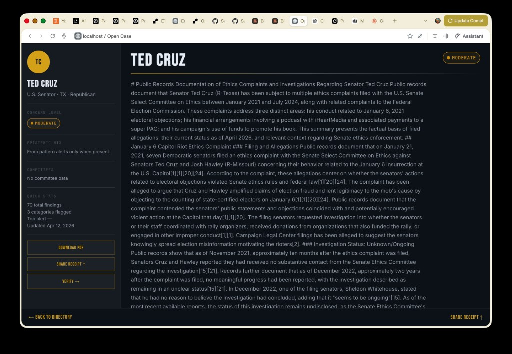

# Public Record — system-wide state report

**Product name in repo:** *Open Case* (FastAPI app title: `OPEN CASE`).  
**This document** uses “Public Record” in the sense of the platform’s mission: **accountability work grounded in government filings and other citable sources**, with cryptographic receipts—not a separate codebase.

**Generated from repository inspection** (April 2026). Intended for product and engineering decisions, not marketing.

---

## 1. What Public Record is

Public Record (Open Case) is a **backend-first investigation engine** for people who need defensible links between **money, decisions, and institutions**—journalists, researchers, and civic investigators. A user opens a **case** for a subject (e.g., a senator, a mayor, a judge), runs an **investigation** that pulls from configured public sources into **evidence rows**, derives **signals** (e.g., donation–vote proximity) and **pattern alerts** (cross-case and rule-based), tags everything with **epistemic levels**, and produces **Ed25519-signed bundles** so a third party can verify the frozen payload. The system deliberately avoids legal conclusions; it mirrors records and surfaces proximity, not verdicts.

Enrichment narratives (e.g., deep-research markdown) render in the same dark dossier shell:

---

## 2. Full annotated file tree (significant paths)

**Root**

| Path | Role |
|------|------|
| `main.py` | FastAPI app, lifespan (migrations, APScheduler enrichment job), static mount of `client/dist` at `/app`, router includes. |
| `database.py` | SQLAlchemy engine/session; `DATABASE_URL` with SQLite fallback; `init_db` / migrations. |
| `models.py` | All ORM tables (cases, evidence, signals, fingerprints, dossiers, pattern records, disputes, audit). |
| `auth.py` | API key hashing, investigator auth helpers. |
| `payloads.py` | Canonical JSON for signing (`open-case-full-4`), methodology note, `apply_case_file_signature`, verification helpers. |
| `signing.py` | JCS canonicalization, SHA-256 digest, Ed25519 sign/verify, `bootstrap_env_keys`, packed `signed_hash` format. |
| `scoring.py` | Investigator credibility bumps. |
| `jobs.py` | Thin job hooks (if used by deploy). |
| `requirements.txt` | Python dependencies (see section 3). |
| `.env.example` | Env template. |
| `README.md`, `ARCHITECTURE.md`, `PHILOSOPHY.md`, `CONSTITUTION.md`, `CONTRIBUTING.md`, `SECURITY.md` | Human-facing docs; **some counts (e.g., rule totals) may lag code.** |
| `open_case.db` | **Local dev artifact** (SQLite); not authoritative for production. |

**`adapters/`** — Source integrations and specialized fetchers (see section 5). Not all are re-exported in `adapters/__init__.py`; investigate pipeline imports many directly.

**`alembic/`** — Migrations (`versions/*.py`), `env.py`.

**`client/`** — Vite React SPA: `src/App.jsx`, `pages/`, `components/`, `lib/`, `dist/` (build output for `/app`).

**`core/`**

| File | Role |
|------|------|
| `credentials.py` | `CredentialRegistry`: FEC, Congress, Regulations.gov, GovInfo, CourtListener, LDA, **open_case_signing**; file fallback under `CREDENTIAL_DATA_DIR`. |
| `subject_taxonomy.py` | Subject types, government levels, branches, defaults. |
| `admin_gate.py` | Admin authorization helper. |
| `datetime_utils.py` | UTC coercion for signing consistency. |
| `subject_name_match.py` | Name matching utilities. |

**`data/`**

| Path | Role |
|------|------|
| `entity_aliases.json` | Global entity resolution aliases (fed/commercial). |
| `reference/local_entity_aliases.json` | Curated **local** vendor-to-donor relationships (Indianapolis + test fixtures). |
| `reference/local_entity_aliases.test.json` | Test jurisdiction (`testville`) rows. |
| `fixtures/hogsett_*.json` | POC procurement + IDIS sample rows. |
| `industry_jurisdiction_map.py` | Sector ↔ committee heuristic data. |
| `subject_type_sources.json` | Large taxonomy / source hints. |

**`docs/internal/`** | `PROJECT_STATE.md`, `PHASE11_VISION.md`, cursor notes — **may be stale vs. main branch.** |

**`engines/`**

| File | Role |
|------|------|
| `pattern_engine.py` | All pattern rules, `run_pattern_engine`, `PATTERN_ENGINE_VERSION`, alert payloads, `sync_pattern_alert_records`. |
| `pattern_alert_epistemic.py` | Aggregates epistemic level from evidence refs; human-review flags. |
| `temporal_proximity.py` | Donation–vote clustering for **signals** (not pattern rules). |
| `contract_proximity.py`, `contract_anomaly.py` | Contract-style signal helpers. |
| `entity_resolution.py` | `canonicalize`, `resolve`, slug IDs, alias table load. |
| `political_calendar.py` | Election/fundraising calendar discounting for bundles. |
| `signal_scorer.py`, `relevance.py` | Signal weighting / relevance. |
| `signal_receipt_backfill.py` | Maintenance/backfill utilities. |

**`routes/`** — HTTP API (see section 12 for overlap with frontend). `investigate.py` is the largest; `reporting.py` serves HTML report + streams; `cases.py` mounts `/cases`; others under `/api/v1/...`.

**`server/`** | `services/report_stream.py` — SSE/pattern refresh for reports. |

**`services/`** — Business logic: `senator_dossier.py`, `gap_analysis.py`, `case_auto_ingest.py`, `proportionality.py`, `epistemic_classifier.py`, `evidence_epistemic.py`, `signal_epistemic.py`, `human_review.py`, `finding_policy.py`, `finding_audit.py`, `enrichment_service.py`, `enrichment_signing.py`, `dossier_claim_dedup.py`, `research_profile.py`, `proportionality_client.py`.

**`signals/dedup.py`** | Signal / evidence dedup hashing. |

**`templates/report.html`** | Jinja template for case report page. |

**`tests/`** | **311** collected tests (`pytest --collect-only`); broad coverage of engines, routes, adapters, signing (see section 14). |

**`utils/`** | `local_entity_matching.py` (curated local relationships), `dossier_pdf.py`, `http_retry.py`. |

**`scripts/`** | Operational scripts: e.g. `run_hogsett_local_poc.py`, batch dossiers, diagnostics. |

---

## 3. Stack — dependencies (`requirements.txt`)

| Package | Version constraint (file) | Purpose |
|---------|---------------------------|---------|
| `fastapi` | >=0.115.0 | HTTP API framework. |
| `uvicorn[standard]` | >=0.32.0 | ASGI server. |
| `sqlalchemy` | >=2.0.36 | ORM, queries. |
| `psycopg2-binary` | >=2.9.0 | PostgreSQL driver (when `DATABASE_URL` is Postgres). |
| `python-dotenv` | >=1.0.1 | Load `.env`. |
| `cryptography` | >=43.0.0 | Ed25519, DER keys. |
| `jcs` | >=0.2.1 | JSON Canonicalization Scheme for signing payloads. |
| `pydantic` | >=2.9.0 | Request/response models. |
| `httpx` | >=0.27.0 | Async HTTP for adapters. |
| `alembic` | >=1.14.0 | DB migrations. |
| `jinja2` | >=3.1.4 | HTML report templates. |
| `pytest` | >=8.0.0 | Tests. |
| `apscheduler` | ==3.10.4 | Scheduled enrichment refresh. |
| `pdfkit` | >=1.0.0 | PDF generation (dossier/report paths). |

**Frontend (client):** not pinned in this file; typical stack is **Vite + React + react-router-dom** (see `client/package.json` if present in your checkout).

---

## 4. Data model (tables)

All in `models.py` unless noted.

| Table | Key fields / purpose | Relationships |
|-------|----------------------|---------------|
| `case_files` | `slug`, subject, jurisdiction, `signed_hash`, `last_signed_at`, `government_level`, `branch`, `pilot_cohort`, `summary_epistemic_level`, statuses | → `evidence_entries`, `snapshots` |
| `evidence_entries` | Rich finding row: `entry_type`, source fields, `raw_data_json`, `epistemic_level`, `adapter_name`, claim/dispute fields, hashes | → `case_file`; → `disputes`, `audit_events` |
| `investigators` | `handle`, `hashed_api_key`, stats | |
| `case_contributors` | Case ↔ investigator roles | → case |
| `source_check_logs` | Adapter query audit | → case |
| `case_snapshots` | Point-in-time `signed_hash`, share URL | → case |
| `signals` | Proximity/anomaly **signals**: weights, evidence_ids JSON, epistemic, exposure/quarantine | → case |
| `signal_audit_log` | confirm/dismiss trail | → signal |
| `adapter_cache` | TTL cache for adapter responses | |
| `subject_profiles` | `bioguide_id`, office metadata, government_level | → case |
| `dispute_records` | Formal dispute tied to evidence | → evidence, optional subject |
| `finding_audit_log` | Classification/render audit | → evidence |
| `political_events` | Calendar events for discounting | |
| `senator_committees` | Cached committee assignments | keyed by `bioguide_id` |
| `donor_fingerprints` | Cross-case donor linkage to signals | → case, signal |
| `investigation_runs` | Run metadata, `top_donors` JSON | → case |
| `enrichment_receipts` | Perplexity-style enrichment batches, signed receipt optional | → case |
| `pattern_alert_records` | **Global** snapshot of last pattern engine sync | |
| `senator_dossiers` | Built dossier JSON + signature + `share_token`, versioning | |

**Used vs stubbed:** All tables are “real” in schema terms. Some features lightly use others (e.g., `enrichment_receipts` depends on enrichment jobs; `dispute_records` / `finding_audit_log` depend on findings API and workflows).

---

## 5. Adapters — sources, outputs, live vs gap

**Investigation pipeline (`routes/investigate.py`) — high level**

- **Local cases** (`case.government_level == "local"`): `IdisCampaignFinanceAdapter`, `IndianapolisContractsAdapter`, `IndianapolisProcurementAdapter` (order in code: IDIS, tax abatement, procurement).
- **Non-local:** FEC, USAspending, Indiana CF gap stub, Congress votes (when subject uses FEC/congress pipeline), CourtListener + FJC (judicial), optional FEC historical / JFC / amendment votes / GovInfo hearings; LDA enrichment on FEC donors; regulations.gov comment fetch for clusters (credential-gated).

| Module | Source | Produces | Live vs notes |
|--------|--------|----------|----------------|
| `fec.py` | FEC API | Schedule A/B-related evidence, committees | Live with `FEC_API_KEY` or demo key |
| `congress_votes.py` | Senate LIS / Congress.gov | Votes, amendments | Live; `CONGRESS_API_KEY` improves matching |
| `usa_spending.py` | USASpending | Awards / obligations evidence | Live (HTTP) |
| `indiana_cf.py` | None (portal links) | **gap_documented** only | Intentional stub |
| `indiana_campaign_finance.py` | IDIS bulk CSV | **financial_connection** rows (IDIS) | Live downloads; subject name matching heuristics |
| `indianapolis_contracts.py` | Indy open data | Tax abatement / contract docs | Live where APIs respond |
| `indianapolis_procurement.py` | Indy procurement normalizer | Procurement **government_record** | Live + normalization helpers |
| `courtlistener.py` | CourtListener API | Docket/opinion-related evidence | Live with optional API key |
| `fjc_biographical.py` | FJC | Judge bio evidence | Live |
| `lda.py` | Senate LDA public API | Lobbying filings (via investigate ingest) | Live, no key |
| `regulations.py` | Regulations.gov | Comment evidence when key present | Gated on `REGULATIONS_GOV_API_KEY` |
| `govinfo_hearings.py` | GovInfo | Hearing witness evidence | Gated on `GOVINFO_API_KEY` |
| `senate_committees.py` | Senate.gov | Committee cache rows | Live scraping/HTML parse |
| `amendment_fingerprint.py` | Congress/FEC context | Amendment-related bundles | Used in dossier / investigate branches |
| `committee_witnesses.py` | Committee hearing context | Witness lists | Dossier pipeline |
| `senator_deep_research.py` | Perplexity API | Deep research categories | **Degraded without `PERPLEXITY_API_KEY`** |
| `staff_network.py` | Perplexity | Staff extraction | Same |
| `perplexity_enrichment.py` | Perplexity | Case enrichment | Optional |
| `stock_act_trades.py`, `stock_trade_proximity.py` | Public STOCK Act sources | Trades / proximity | Live with fallbacks logged |
| `ethics_travel.py`, `dark_money.py` | Various | Supplemental dossier lists | Try/except in dossier build |
| `planned.py` | N/A | `PLANNED_STUB_SOURCE_NAMES` registry | **Stubs only** — log planned |

---

## 6. Pattern engine — rules by ID

**Engine version:** `PATTERN_ENGINE_VERSION = "2.6"` (`engines/pattern_engine.py`).

**Epistemic handling:** After all rules run, `enrich_pattern_alerts_epistemic_metadata` sets alert `epistemic_level` from referenced evidence (weakest-wins aggregation) and `requires_human_review` via `human_review.pattern_alert_requires_human_review`.

**Subject / case gating:** Most rules use **DonorFingerprint + Signal** appearances and/or votes — effectively **federal legislator-style cases with fingerprints**. **Local rules** additionally require `CaseFile.government_level == "local"` and specific adapters (`INDY_*`, `IDIS`).

| Rule ID | Family (see section 7) | Subject / data dependency | Score (typical) | Epistemic | Status |
|---------|-----------------|---------------------------|-----------------|-----------|--------|
| `COMMITTEE_SWEEP_V1` | Cross-case legislature | Multi-senator committee overlap via fingerprints | Weighted fields; report uses vote proximity where set | From evidence | **Active** |
| `FINGERPRINT_BLOOM_V1` | Cross-case legislature | Same donor in many cases | Relevance-based threshold | From evidence | **Active** |
| `SOFT_BUNDLE_V1` | Proximity bundle | Donations clustered near calendar/votes | `final_weight` 0–1 scale in rule | From evidence | **Active** |
| `SOFT_BUNDLE_V2` | Proximity bundle v2 | Same + sector/baseline/hearing weights | 0–1 | From evidence | **Active** |
| `SECTOR_CONVERGENCE_V1` | Sector | Sector donors vs committee jurisdiction | Suspicion / concentration fields | From evidence | **Active** |
| `GEO_MISMATCH_V1` | Geo | Out-of-state vs in-state donors | Ratio-based | From evidence | **Active** |
| `DISBURSEMENT_LOOP_V1` | Money loop | PAC disbursement chains | Pattern-specific | From evidence | **Active** |
| `JOINT_FUNDRAISING_V1` | JFC | Joint fundraising evidence | Pattern-specific | From evidence | **Active** |
| `BASELINE_ANOMALY_V1` | Temporal baseline | Spike vs 7-day median intake | 0–1 style | From evidence | **Active** |
| `ALIGNMENT_ANOMALY_V1` | Vote alignment | Sector alignment vs chamber baseline | Rate-based | From evidence | **Active** |
| `AMENDMENT_TELL_V1` | Amendment | Amendment timing vs donors | Pattern-specific | From evidence | **Active** |
| `HEARING_TESTIMONY_V1` | Hearing | GovInfo witness linkage | **Skips / no-op if GovInfo credential missing** | From evidence | **Active (conditional)** |
| `REVOLVING_DOOR_V1` | LDA / employment | LDA + donor overlap | Pattern-specific | From evidence | **Active** |
| `LOCAL_CONTRACTOR_DONOR_LOOP_V1` | Local procurement | Local case + procurement + IDIS; direct or **alias** match only | `_local_loop_score` ~0.05–1.0 | From evidence | **Active** |
| `LOCAL_CONTRACT_DONATION_TIMING_V1` | Local procurement | **Award-only** procurement event + timing window | Loop score + 0.22 cap 1.0 | From evidence | **Active** |
| `LOCAL_VENDOR_CONCENTRATION_V1` | Local procurement | Top vendor/donor overlap | ~0.35–1.0 band | From evidence | **Active** |
| `LOCAL_RELATED_ENTITY_DONOR_V1` | Local related entity | Curated **related_entity** only; **award / supply_purchase** only | 0.35–0.72 | From evidence | **Active** |

**Honest caveat:** Exact numeric ranges for every federal rule vary by sub-calculation; the table reflects code intent. Unit tests lock behavior for many rules, not all edge weights.

---

## 7. Rule families

**Cross-case / chamber** (`COMMITTEE_SWEEP`, `FINGERPRINT_BLOOM`): Shared policy — fingerprints and committee maps; donor appears across cases or sweeps a committee.

**Proximity / calendar** (`SOFT_BUNDLE`, `SOFT_BUNDLE_V2`, `BASELINE_ANOMALY`, `AMENDMENT_TELL`): Shared policy — `political_calendar` discounts, vote context flags, temporal windows.

**Sector / money structure** (`SECTOR_CONVERGENCE`, `GEO_MISMATCH`, `DISBURSEMENT_LOOP`, `JOINT_FUNDRAISING`, `ALIGNMENT_ANOMALY`): Shared policy — FEC/donor structure, committee labels, sector maps.

**Hearing / lobbying** (`HEARING_TESTIMONY`, `REVOLVING_DOOR`): Shared policy — GovInfo vs LDA availability; both are “peripheral record” classes.

**Local procurement** (all `LOCAL_*`): Shared policy — `utils/local_entity_matching` + `data/reference/local_entity_aliases*.json`; **non-fuzzy**; loop/timing only **direct + alias**; related entity is separate rule with stricter event types.

**Planned (not implemented as named families in code):** Registry in `adapters/planned.py` lists **source** stubs, not pattern families. Roadmap for **related_entity_influence** is in section 18.

---

## 8. Signing and receipts

**Keys:** `OPEN_CASE_PRIVATE_KEY` / `OPEN_CASE_PUBLIC_KEY` (base64 DER). `signing.bootstrap_env_keys` can **auto-generate and append to `.env`** on first boot if missing.

**Case seal:** `apply_case_file_signature` builds `seal_case_bundle` (`open-case-full-4`): case fields, ordered evidence semantic dicts, **pattern_alerts** from `run_pattern_engine` → `pattern_alerts_for_signing`, **case_signals** (proportionality receipts), epistemic distribution, methodology note. Then `sign_payload`: **JCS canonicalize → SHA-256 hex → Ed25519 sign digest string as UTF-8 bytes** → `content_hash`, `signature`, `public_key` embedded in signed object. DB stores `pack_signed_hash` JSON on `case_files.signed_hash` including embedded payload.

**Per-entry signing:** `sign_evidence_entry` packs semantic evidence dict similarly.

**Verification:** `verify_signed_hash_string` / `verify_case_file_seal` — recompute JCS hash over semantic body; verify signature with public key; supports legacy bundle shapes without pattern alerts.

**Pattern snapshot:** `sync_pattern_alert_records` replaces `pattern_alert_records` table with global engine output (not per-case isolation).

**Dossier:** `services/senator_dossier.build_senator_dossier` signs a **different** payload (`schema_version` 2.0) containing deep research, staff, gaps, pattern alerts for that case, etc.

---

## 9. Investigation pipeline (case → signed output)

1. **Case created** via `/cases` API (subject, jurisdiction, `government_level`, etc.) + contributor + optional `SubjectProfile`.
2. **POST investigate** (`/api/v1/cases/{id}/investigate` — see `routes/investigate.py`): ensure investigator, sync profile, **delete existing signals and evidence** for case (reinvestigation replaces evidence).
3. **`_run_investigation_adapters`:** local vs federal adapter set; optional FEC committee resolution; cache via `adapter_cache`; ingest results into `evidence_entries` with dedup hashes.
4. **`_ingest_lda_for_unique_donors`:** LDA filings for unique FEC donors (cap `MAX_LDA_DONORS_PER_RUN`).
5. **`detect_proximity` / `detect_contract_*`:** build candidate **signals**; regulations.gov enrichment for clusters if key present.
6. **`upsert_signal`:** persist signals; epistemic refresh per signal; **fingerprints** and cross-case baselines.
7. **`InvestigationRun`:** record top donors snapshot.
8. **`apply_case_file_signature`:** run **full pattern engine** on DB, persist `pattern_alert_records`, seal case with proportionality payloads.
9. **Response:** signal summaries, errors, source_statuses, optional debug pairing stats.

**Failure modes:** Required sources can fail closed (422) with rollback; zero-signal reinvestigation may rollback to preserve prior signals (see HTTP422 branch in investigate).

---

## 10. Senator dossier pipeline

1. **Create dossier row** — `POST /api/v1/senators/{bioguide_id}/dossier` creates `SenatorDossier` with `status=building`, `share_token`, version chain.
2. **Build** — `build_senator_dossier`: requires matching `SubjectProfile` + `CaseFile`.
3. **Steps:** `maybe_auto_ingest_case`; `fetch_all_senator_deep_research` (Perplexity); `fetch_staff_network`; `get_or_refresh_senator_committees`; `generate_gap_sentences`; **pattern alerts** filtered to case; stock trade / amendment / dark money / ethics / witnesses (try/except per block); assemble body; **`sign_payload`**; store JSON + packed signature; mark completed.
4. **Dedup / claims:** `services/dossier_claim_dedup.py` and claim grouping used in dossier presentation layers.
5. **Render:** API PDF path (`utils/dossier_pdf.py`), public JSON view, SPA **VerifyPage** for dossier id.

**Caching:** Adapter cache for generic adapters; committee rows in DB; dossier JSON is a **versioned blob** on `senator_dossiers`.

---

## 11. Local government pipeline (Hogsett POC)

- **Case model:** `government_level=local`, Indianapolis jurisdiction; pilot cohort possible.
- **Adapters:** IDIS bulk (`IdisCampaignFinanceAdapter`), Indianapolis contracts (tax abatement), Indianapolis procurement (DPW-style awards).
- **Fixtures:** `data/fixtures/hogsett_procurement_sample.json`, `hogsett_donors_sample.json` — hand-curated overlaps for tests/POC.
- **Alias infrastructure:** `data/reference/local_entity_aliases.json` (+ `.test.json`); `utils/local_entity_matching.py`; env override `OPEN_CASE_LOCAL_ENTITY_ALIASES` for tests.
- **Pattern rules:** Four `LOCAL_*` rules (loop, timing, concentration, related entity); diagnostics for related-entity skips in module + `scripts/run_hogsett_local_poc.py`.
- **Honest status:** **Procurement + IDIS paths are implemented and tested**, but **coverage is only as good as ingest + curated aliases** — not a general “all Indiana local money” product. Indiana CF adapter remains a **manual gap** for non-IDIS state finance. README / marketing tables may **undercount** local rules.

---

## 12. Frontend

**Routes (`client/src/App.jsx`):**

| Route | Page | What it does |
|-------|------|--------------|
| `/` | `HomePage` | Nav, search, featured officials — **wired to API/search helpers** in `lib/`. |
| `/official/:id` | `OfficialPage` | Senator-style profile: loads dossier/API, SSE or polling patterns, tabs (`SixTabProfile`), pattern cards, timeline, receipt. |
| `/senator/:bioguide_id` | Redirect | Legacy → `/official/:id`. |
| `/verify/:dossier_id` | `VerifyPage` | Verification UX for signed dossier payload. |
| `*` | Redirect home | |

**Components (representative):** `PatternAlerts`, `PatternAlertCard`, `InvestigationReceipt`, `OfficialCard`, `StaffNetwork`, `GapAnalysis`, `Timeline`, `InfluenceGraphSections`, `EpistemicBar`, `ConcernBadge`, `ClaimsAccordion`, `HeroSection`, `BottomBar`, `LoadingScreen`, etc.

**Libs:** `api.js` (fetch helpers), `dossierParse.js`, `patternAlertLabels.js`, `navigationTaxonomy.js`, `subjectLabels.js`, `officialsDirectory.js`, `constants.js`.

**Wired vs stubbed:** Official flow is the most wired end-to-end **when API + built `client/dist` are deployed**. Home may include static/seed data for demos. Anything not reachable from `api.js` base URL is effectively stubbed in production until backend routes exist.

**Backend HTML:** `templates/report.html` + `routes/reporting.py` — **separate** from React SPA; used for signed case report pages and pattern refresh streaming.

---

## 13. Epistemics

**Labels** (`services/epistemic_classifier.py`): `VERIFIED`, `REPORTED`, `ALLEGED`, `DISPUTED`, `CONTEXTUAL`.

| Label | When assigned (typical) |
|-------|-------------------------|
| `VERIFIED` | Source URL/domain heuristics match government / court / official record hosts; or explicit classification on ingest. |
| `REPORTED` | Default; credible press domains; unspecified. |
| `ALLEGED` | Complaint / legal filing cues in URL or text. |
| `DISPUTED` | Dispute hints (`DISPUTED_HINTS`) or dispute workflow updates claim status. |
| `CONTEXTUAL` | Social/wiki-style sources — often **excluded from public API** via `requires_human_review` / render flags. |

**Evidence:** `EvidenceEntry.epistemic_level`, `classification_basis`, claim fields, `is_publicly_renderable`, `requires_human_review`.

**Signals:** `refresh_signal_epistemic_from_evidence` aggregates from linked evidence.

**Pattern alerts:** `pattern_alert_epistemic.py` aggregates evidence levels; `pattern_alert_requires_human_review` can force review for sensitive combos.

**Disputes:** `DisputeRecord` on a finding; `FindingAuditLog` records events; `finding_policy` / `finding_audit` services implement governance — **full UX maturity varies**.

---

## 14. Tests

- **Count:** **311** tests collected (`pytest --collect-only`, this checkout).
- **Run:** `pytest` from repo root; `pytest tests/test_local_pattern_rules.py` for local rules; `pytest tests/test_pattern_engine.py` for engine.
- **Suites:** `tests/test_*` cover adapters (FEC, Congress, IDIS, Indianapolis, CourtListener, FJC…), pattern engine, investigate flows, signing, subjects, findings architecture, proportionality, senator dossier, admin gates, epistemic architecture, etc.
- **Gaps (honest):** Not every adapter has network-offline integration tests; some tests mock external HTTP; E2E browser flows are thin; frontend tests are **not** in the pytest count (if present, separate runner).

---

## 15. Deployment

- **Where:** Designed for generic Linux/ container hosts; `database.py` mentions **Render** + Postgres; SQLite fallback for dev.
- **Required / critical env:**
  - **`DATABASE_URL`** — unset → local `sqlite:///./open_case.db` with warning.
  - **`OPEN_CASE_PRIVATE_KEY` / `OPEN_CASE_PUBLIC_KEY`** — auto-generated locally; **production must pin stable keys** or seals become unverifiable across rotations.
  - **`BASE_URL`** — **required sane value in production** (`main.check_config_warnings` exits if production + localhost/empty).
  - **`ENV`** — `production` triggers stricter checks.
- **Optional but impactful:** `FEC_API_KEY`, `CONGRESS_API_KEY`, `REGULATIONS_GOV_API_KEY`, `GOVINFO_API_KEY`, `COURTLISTENER_API_KEY`, `PERPLEXITY_API_KEY`, `CREDENTIAL_DATA_DIR` for file-backed secrets.
- **Static app:** Build `client` → `client/dist` for `/app` mount; without dist, only API + templates apply.

---

## 16. Known issues and gaps

- **Documentation drift:** README rule count (e.g., “thirteen rules”) **does not match** `PATTERN_RULE_IDS` size (17 rules in code including locals and `SOFT_BUNDLE_V2`).
- **Methodology note** in `payloads.py` still claims some channels “unavailable” — may be **stale** relative to current credentials.
- **`pattern_alert_to_report_dict`:** Only some rules have bespoke badge text; many federal rules still fall through to **generic / fingerprint-style** legacy else branch — **report HTML can mis-label** non-fingerprint rules.
- **Indiana “Campaign Finance” adapter** is **gap-only**; real bulk IDIS is separate adapter used for local/Indianapolis path.
- **Reinvestigation destroys evidence** — intentional, but dangerous without UX warnings.
- **Pattern alerts are global snapshot** — `pattern_alert_records` is not per-case; understanding “this case only” requires filtering `matched_case_ids`.
- **GovInfo / Regulations** — rules and enrichments **degrade** without keys.
- **Perplexity** — dossier “deep research” and staff are **thin or empty** without `PERPLEXITY_API_KEY`.
- **Frontend / backend duplication** — React app vs Jinja report serve similar concepts differently; risk of divergence.
- **`planned.py`:** Many source IDs logged as future work — **not implemented**.

---

## 17. Demo-ready for a journalist (minimum work)

**Already strong:** Signed case bundles, FEC + vote proximity story, pattern alerts on senators with fingerprints, local Indianapolis POC with fixtures, epistemic labeling concept.

**Minimum to credibly demo to a journalist:**

1. **Stable deploy** with Postgres, real `BASE_URL`, fixed signing keys, and **built SPA**.
2. **One golden path scripted:** e.g. “Senator X” case with FEC + votes + one SOFT_BUNDLE alert + readable HTML or SPA view **without** exposing quarantined/unreviewed clutter.
3. **Fix report labeling** for top federal rules (or route journalists to SPA only).
4. **Short methodology card** accurate to what keys you actually configured (update static note or generate dynamically).
5. **Consent / ethics copy** on what is not proven (already in philosophy — surface in UI).

**Honest assessment:** The engine is ahead of the **polished narrative UX**. A journalist can understand outputs if someone guides them; **self-serve clarity** still needs work.

---

## 18. Rule family roadmap — `related_entity_influence`

**Current member:** `LOCAL_RELATED_ENTITY_DONOR_V1` — curated JSON relationships (`affiliate`, `pac_of_vendor`, `parent`, `subsidiary`) between procurement vendor labels and IDIS donors; **no fuzzy matching**.

**Planned / conceivable members (not built):**

| Planned rule (conceptual ID) | Needs |
|------------------------------|--------|
| `RELATED_ENTITY_TIMING_V1` | Policy choice: whether timing proximity is meaningful for non-same-entity links; separate score curve; avoid conflating with direct loop. |
| `RELATED_ENTITY_CONCENTRATION_V2` | Extend concentration to count **related_entity** overlaps separately from alias/direct; richer `payload_extra` for mixed families. |
| `STATE_PAC_REGISTRY_LINK_V1` | Structured state-to-vendor registry ingestion (beyond hand-curated JSON). |
| `SUBSIDIARY_GRAPH_V1` | SEC / business registry graph with provenance and refresh strategy. |
| `CROSS_CASE_RELATED_ENTITY_V1` | Fingerprint or entity-resolution graph across cases for same PAC family. |

**Shared policy for the family:** Explicit provenance (`relationship_source_note`, `relationship_type`), **no fuzzy graph inference** unless a separate epistemic tier is defined, and UI copy that **never implies same-entity donation** without `match_type=direct|alias`.

---

*End of report.*
